# CS2 Market Analysis ELT Pipeline


An end-to-end, data engineering ELT pipeline for analyzing the CS2 market.

---

<details open>
<summary>Table of Contents</summary>

- [Problem Statement](#problem-statement)
- [Architecture & Tech Stack](#architecture--tech-stack)
- [Technical Decisions & Trade-Offs](#technical-decisions--trade-offs)
- [Quick Start (Frictionless Deployment)](#quick-start)
- [Project Structure](#project-structure)
- [Future Improvements](#future-improvements)

</details>

---

## Problem Statement

The Counter-Strike 2 (CS2) virtual item market is a highly dynamic economy, with
thousands of item prices fluctuating daily based on supply, demand, and game updates.
Analyzing this market is not straightforward since Steam's native REST APIs are heavily
rate-limited, paginated, and provide a mix of unstructured and semi-structured data.
Some apis return JSON, others return HTML inside of JSON, and for others we need to extract data from HTML pages.
This makes it difficult to track long-term historical trends, evaluate skin valuations, or perform large-scale market analysis reliably.

This project addresses this data bottleneck by building an automated, cloud-native ELT pipeline.
It extracts daily market data and price histories using proxy rotation to navigate API limits, normalizes the raw data into a Google Cloud Storage data lake, and models it within BigQuery. The final output is an interactive BI dashboard built with Observable Framework hosted on Cloudflare Workers, allowing users to explore market trends and insights.


## Architecture & Tech Stack

This project uses the following stack:

* **Infrastructure as Code (IaC)** | [Pulumi](https://www.pulumi.com/) (Python)
  - Provisioning GCP resources: Google Cloud Storage (GCS), BigQuery, Artifact Registry, and Service Accounts
* **Orchestration** | [Prefect](https://www.prefect.io/)
  - Defines and orchestrates the execution of dlt pipelines and dbt transformations
  - Workflows are executed as Cloud Run Jobs, not via Prefect agents or work pools
  - Uses a custom deployment script to build and push Docker images, then updates the Cloud Run Job to use the new image
  - Cloud Scheduler triggers the Cloud Run Job on a schedule
* **Data Extraction/Loading (EL)** | [dlt](https://dlthub.com/)
  - Extracts data from Steam's REST APIs for CS2 market items and price history using proxy rotation and pagination
  - Normalizes and loads raw data into GCS (data lake) as Parquet files for staging
  - Loads data from GCS to BigQuery (data warehouse)
* **Data Transformation (T)** | [dbt](https://www.getdbt.com/)
  - Transforms raw data in BigQuery into cleaned and modeled tables for analysis
  - Implements data quality tests and documentation for transformed models
  - Exports reporting models back to GCS as Parquet files for dashboard consumption using a post-hook macro
* **Proxy Provider** | [Webshare.io](https://www.webshare.io/?referral_code=1omcktoaxbhl)
  - Rotating proxies to avoid rate limits when extracting data from Steam's APIs
* **Data Lake** | Google Cloud Storage Bucket
* **Data Warehouse** | Google BigQuery
* **BI Dashboard** | [Observable Framework](https://observablehq.com/framework/)
* **Dashboard Hosting** | [Cloudflare Workers](https://workers.cloudflare.com/)

```mermaid
---
config:
  flowchart:
    defaultRenderer: "elk"
---
flowchart LR
    %% ========================================================
    %% 1. NODES & STRUCTURE (Declarations Only)
    %% ========================================================
    
    %% External Data Sources
    steam_market["Steam Market"]@{ shape: rect }
    proxy_server["Proxy"]@{ shape: rect }

    %% Google Cloud Environment
    subgraph gcp_cloud["`**Google Cloud Platform**`"]

        %% Orchestration & Control Plane
        subgraph control_plane["Control Plane"]
            artifact_registry["Artifact Registry"]@{ shape: cyl }
            cloud_scheduler["Cloud Scheduler"]@{ shape: stadium }
            secret_manager["Secret Manager"]@{ shape: rect }

            subgraph cloud_run_env["`**Cloud Run** (Docker)`"]
                subgraph prefect_orchestration["Prefect Flow"]
                    task_extract_load["Extract/Load \n (dlt)"]@{ shape: h-cyl }
                    task_transform["Transform \n (dbt)"]@{ shape: h-cyl }
                    task_build["Build \n (bun)"]@{ shape: h-cyl }
                    task_deploy["Deploy \n (Wrangler)"]@{ shape: h-cyl }
                end
            end
        end

        subgraph gcs_datalake["`**Cloud Storage** (Data Lake)`"]
            raw_data_gcs["Raw Data \n (as Parquet)"]@{ shape: procs }
            parquet_export["Parquet \n Files"]@{ shape: procs }
        end

        subgraph bigquery_dw["`**BigQuery** (Data Warehouse)`"]
            bq_raw["Raw"]@{ shape: das }
            bq_staging["Staging"]@{ shape: das }
            bq_intermediate["Intermediate"]@{ shape: das }
            bq_marts["Marts"]@{ shape: das }
            bq_reporting["Reporting"]@{ shape: das }
        end
    end

    %% Edge Cloud / Frontend
    subgraph cloudflare_edge["Cloudflare Workers"]
        observable_dashboard["Observable Framework \n BI Dashboard"]
    end

    %% ========================================================
    %% 2. EDGES & CONNECTIONS
    %% ========================================================

    %% --- Data Flow Connections (Animated - Indexes 0 to 10) ---
    steam_market f1@--> proxy_server
    proxy_server f2@--> task_extract_load
    task_extract_load f3@--> raw_data_gcs
    raw_data_gcs f4@--> bq_raw
    bq_raw f5@--> bq_staging
    bq_staging f6@--> bq_intermediate
    bq_intermediate f7@--> bq_marts
    bq_marts f8@--> bq_reporting
    bq_reporting f9@-->|"dbt post-hook"| parquet_export
    parquet_export f10@--> task_build
    task_deploy f11@--> observable_dashboard

    f1@{ animate: true }
    f2@{ animate: true }
    f3@{ animate: true }
    f4@{ animate: true }
    f5@{ animate: true }
    f6@{ animate: true }
    f7@{ animate: true }
    f8@{ animate: true }
    f9@{ animate: true }
    f10@{ animate: true }
    f11@{ animate: true }

    %% --- Prefect Internal Dependency Flow (Animated - Indexes 11 to 13) ---
    task_extract_load p1@-.-> task_transform 
    task_transform p2@-.-> task_build 
    task_build p3@-.-> task_deploy
    
    p1@{ animate: true }
    p2@{ animate: true }
    p3@{ animate: true }

    %% --- Control Flow Connections (Dotted Lines - Indexes 14 to 17) ---
    artifact_registry -. "Pulls Image" .-> cloud_run_env
    cloud_scheduler -. "Triggers via Push" .-> cloud_run_env
    secret_manager -. "Injects" .-> cloud_run_env
    task_transform -. "Orchestrates" .-> bigquery_dw


    %% ========================================================
    %% 3. STYLING & CLASSES
    %% ========================================================
    
    %% Base style for unassigned elements
    classDef default fill:transparent,stroke:#888,stroke-width:1.5px;
    
    %% Container Outlines
    classDef gcpContainer fill:transparent,stroke:#5f6368,stroke-width:2px;
    classDef cloudflareContainer fill:#9E339F0D,stroke:#9E339F,stroke-width:1.5px,stroke-dasharray: 5 5;
    
    %% Updated Subgraph Styling with Custom Text Colors
    classDef controlPlane fill:#5C6BC00A,stroke:#5C6BC0,stroke-width:1.5px,stroke-dasharray: 5 5;
    classDef dockerEnv fill:#4285F40A,stroke:#4285F4,stroke-width:1.5px,stroke-dasharray: 5 5,color:#4285F4;
    classDef dataLake fill:#FBBC040A,stroke:#FBBC04,stroke-width:1.5px,stroke-dasharray: 5 5,color:#FBBC04;
    classDef dataWarehouse fill:#34A8530A,stroke:#34A853,stroke-width:1.5px,stroke-dasharray: 5 5,color:#34A853;
    
    classDef prefectFlow fill:transparent,stroke:#4285F4,stroke-width:1px;
    
    %% Node Outlines 
    classDef computeNode fill:#4285F433,stroke:#4285F4,stroke-width:2px; 
    classDef bqNode fill:#34A85333,stroke:#34A853,stroke-width:2px;
    classDef gcsNode fill:#FBBC0433,stroke:#FBBC04,stroke-width:2px;
    classDef edgeNode fill:#9E339F33,stroke:#9E339F,stroke-width:2px;
    
    %% Singletons
    classDef secretManagerStyle fill:#FBBC0433,stroke:#FBBC04,stroke-width:2px;
    classDef cloudSchedulerStyle fill:#34A85333,stroke:#34A853,stroke-width:2px;
    classDef artifactRegistryStyle fill:#EA433533,stroke:#EA4335,stroke-width:2px;

    %% --- Apply Classes ---
    class gcp_cloud gcpContainer;
    class cloudflare_edge cloudflareContainer;
    class control_plane controlPlane;
    class gcs_datalake dataLake;
    class bigquery_dw dataWarehouse;
    class cloud_run_env dockerEnv;
    class prefect_orchestration prefectFlow;
    
    class bq_staging,bq_intermediate,bq_marts,bq_reporting,bq_raw bqNode;
    class raw_data_gcs,parquet_export gcsNode;
    class task_extract_load,task_transform,task_build,task_deploy computeNode;
    class steam_market,proxy_server,observable_dashboard edgeNode;
    
    class secret_manager secretManagerStyle;
    class cloud_scheduler cloudSchedulerStyle;
    class artifact_registry artifactRegistryStyle;
    
    %% --- Link Styles ---
    %% Default all non-data lines to a softer grey
    linkStyle default stroke:#9AA0A6,stroke-width:1.5px,fill:none;
    
    %% Primary Animated Data Path (Indexes 0 through 10) - Vibrant Green & Thicker
    linkStyle 0,1,2,3,4,5,6,7,8,9,10 stroke:#0F9D58,stroke-width:2.5px,fill:none;
    
    %% Prefect Internal Flow Path (Indexes 11 through 13) - Blue & Dashed
    linkStyle 11,12,13 stroke:#4285F4,stroke-width:2.5px,fill:none,stroke-dasharray:5 5;
    %% --- Link Styles ---
    %% Default all non-data lines to a softer grey
    linkStyle default stroke:#333,stroke-width:1.5px;
    
    %% Primary Animated Data Path (Indexes 0 through 10) - Vibrant Green & Thicker
    linkStyle 0,1,2,3,4,5,6,7,8,9,10 stroke:#0F9D58,stroke-width:2.5px;
    
    %% Prefect Internal Flow Path (Indexes 11 through 13) - Blue & Dashed
    linkStyle 11,12,13 stroke:#4285F4,stroke-width:2.5px;
```




---

## Technical Decisions & Trade-Offs

Building an automated, serverless pipeline for 31,000+ items required balancing performance, security, and observability. Here are the key architectural decisions made during development:

### 1. Navigating Rate Limits and Scale (dlt + Proxies)
* **The Challenge:** Steam's REST APIs are heavily paginated and enforce strict rate limits, making it difficult to extract the entire 31,000+ item catalog reliably.
* **The Solution:** The extraction phase utilizes `dlt`'s built-in REST API paginator mapped to the `total_count` response, paired with a custom `requests` session. By injecting Webshare.io rotating proxies into the session and suppressing default HTTP error handling, the pipeline gracefully navigates rate limits without dropping connections or requiring complex custom backoff logic.

### 2. Keyless Authentication via ADC (Security & DX)
* **The Challenge:** Managing static JSON Service Account keys across multiple tools (Pulumi, Prefect, dlt, dbt) creates friction, security vulnerabilities, and deployment headaches.
* **The Solution:** The project implements a frictionless, "keyless" design using Google Cloud's Application Default Credentials (ADC). 
    * Locally, tools read the user's short-lived `gcloud` token via a single `.env` file. 
    * In production, Pulumi provisions a dedicated Service Account and attaches it directly to the Cloud Run compute instance. 
    * By configuring dbt to use `method: oauth` and leaving `dlt`'s destination credentials empty, the tools implicitly inherit permissions from the compute environment via the GCP Metadata Server. Zero manual JSON keys are handled by the user.

### 3. Prioritizing Observability Over Micro-Optimizations (Prefect + dbt Core)
* **The Challenge:** Integrating dbt transformations with ingestion (`dlt`) and orchestration (`Prefect`) presented multiple paths: using dlt's native dbt runner, switching to dbt Fusion for raw speed, or treating dbt as first-class Prefect tasks.
* **The Solution:** After initial friction with recurring installation and dependency issues in other orchestrators like Bruin, the pipeline was standardized on Prefect. `prefect-dbt` was chosen to execute standard dbt Core inside the Cloud Run container. 
    * *Trade-off:* While `dlt`'s runner or `dbt Fusion` could marginally improve execution speed or simplify setup, the pipeline is highly network-bound during the extraction phase, not the transformation phase. Therefore, micro-optimizing dbt execution speed was not worth sacrificing the granular retries, lineage tracking, and UI observability that `prefect-dbt` provides when a specific model fails.

---

## Quick Start
### 1. Prerequisites

- Accounts:
  - Google Cloud Project with Billing Enabled (free credits available)
    - Authentication configured (`gcloud auth application-default login`)
    - Enable [Artifact Registry API](https://console.cloud.google.com/apis/library/artifactregistry.googleapis.com)
    - Enable [Secret Manager API](https://console.cloud.google.com/apis/library/secretmanager.googleapis.com)
    - Enable [Cloud Run API](https://console.cloud.google.com/apis/library/run.googleapis.com)
    - Enable [Cloud Scheduler API](https://console.cloud.google.com/apis/library/cloudscheduler.googleapis.com)
  - [Prefect Cloud](https://app.prefect.cloud/auth/sign-up) account (Free tier is sufficient)
  - [Pulumi Cloud](https://app.pulumi.com/signup) account (Free tier is sufficient)
  - [Webshare.io](https://www.webshare.io/?referral_code=1omcktoaxbhl) to avoid IP blocking and rate limits ($9/month for 3GB bandwidth is enough for 2 days of data extraction)
  - [Cloudflare](https://dash.cloudflare.com/sign-up) account to deploy the dashboard (free tier is sufficient)
- Tools:
  - [git](https://git-scm.com/install/) for cloning the repo
  - [mise](https://mise.jdx.dev/) for installing the necessary tools (if using bash shell install with `curl https://mise.run/bash | sh`)
    - Google Cloud CLI (`gcloud`) for authentication
    - Pulumi CLI for provisioning infrastructure
  - [uv](https://docs.astral.sh/uv/getting-started/installation)
  - [Docker](https://docs.docker.com/engine/install/)

### 2. Setup & Running the pipeline

```bash
# 1. Get the code
git clone https://github.com/CarlosGTrejo/CS2-Market-Analysis.git
cd CS2-Market-Analysis

# 2. Use mise to install gcloud and pulumi
mise i

# 2. Authenticate local machine with Google Cloud
#    if you have already initialized gcloud and have muliple projects
#    use `gcloud config set project PROJECT_ID` to switch to the correct project
gcloud init
gcloud auth application-default login

# 3. Fill in the specific API keys
cp .env.example .env
nano .env

# 4. Install python dependencies
uv sync --locked

# 5. Authenticate with Pulumi
pulumi login

# 6. Authenticate with Prefect Cloud (follow interactive prompts)
uv run prefect cloud login

# 7. Stand up the GCP infrastructure (GCS, BigQuery, Artifact Registry, Cloud Run Job, Cloud Scheduler)
# (Pulumi will automatically use the gcloud credentials from step 2)
uv run --env-file .env pulumi up -C infra/

# 8. Configure Docker auth for the Artifact Registry host created by infra
AR_HOST="$(uv run pulumi stack output artifact_registry_url -C infra | cut -d/ -f1)"

# For powershell:
$AR_HOST = ((uv run pulumi stack output artifact_registry_url -C infra) -split '/')[0]

gcloud auth configure-docker "$AR_HOST"

# 9. Build, push, and deploy the Docker image to Cloud Run
# (The deployment script builds the Docker image, pushes it to Artifact Registry, and updates the Cloud Run Job to use the new image)
# Requires a reachable Docker daemon and a BuildKit-capable builder.
DOCKER_BUILDKIT=1 uv run --env-file .env flows/deploy.py

# For Powershell:
$env:DOCKER_BUILDKIT=1
uv run --env-file .env flows/deploy.py
```

---

## Project Structure

```
CS2-Market-Analysis/
│
├── dashboard/                    # Observable Framework dashboard code
│   ├── src/
│   │   ├── data/                 # Data loaders for fetching parquet files from GCS
│   │   └── index.md              # Defines the UI and visualizations
│   ├── worker.js                 # Pulls duckdb wasm from CDN since it was too big for Wrangler CLI
│   └── wrangler.toml             # Specifies our dist directory as an asset and sets the worker entrypoint to worker.js
│
├── flows/                        # Prefect Orchestration & Deployments
│   ├── deploy.py                 # Builds Docker image & deploys to Google Artifact Registry
│   └── main_flow.py              # Orchestrates the pipeline and dashboard build/deploy
│
├── infra/                        # Pulumi Infrastructure as Code (Python)
│   ├── __main__.py               # Defines GCP resources: GCS, BigQuery, Artifact Registry, Secret Manager, Service Accounts
│   ├── Pulumi.yaml               # Pulumi project configuration
│   └── Pulumi.prod.yaml          # Prod-specific configuration, left blank to force Pulumi to fetch gcp project from env vars
│
├── pipelines/                    # Data Pipelines (Extract, Load, Transform)
│   ├── extract_load/             # dlt pipeline (Extract & Load)
│   │   └── ingest_market_data.py # extracts and loads market data (items and price history) with minor transformations for normalization
│   │  
│   └── transform/                # dbt project (Transform)
│       ├── dbt_project.yml       # Specifies materialization strategies, partitioning, and clustering
│       ├── profiles.yml          # dynamic profile configuration using env vars
│       ├── macros/               # dynamic profile configuration using env vars
│       │   └─ export_parquet.sql # A post-hook macro to export reporting models to GCS as parquet files for dashboard consumption
│       └── models/               # dbt SQL transformation models for BigQuery (staging, intermediate, marts, reporting)
│
├── .dockerignore                 # Ignore file for Docker builds, keeps the image lean by excluding unnecessary files
├── .env.example                  # Example environment variables
├── .gitignore
├── .python-version               # Specifies the Python version for uv
├── Dockerfile                    # Optimized dockerfile, leveraging multi-stage builds and BuildKit for efficient image building
├── mise.toml                     # Specifies tools to be installed with mise for development (gcloud, pulumi)
├── pyproject.toml                # Python dependencies (uv), including group dependencies for different parts of the project (main, dev, pipeline inspection)
└── uv.lock                       # Locked dependencies for reproducible environments
```

---

## Future Improvements

- Use CI/CD (GitHub Actions) to automate deployments on code changes
- Improve image tag management for traceability and rollback
- Leverage dbt cloud for improved observability
- Implement notifications and alerting for pipeline failures and runs
- Modify Pulumi code to provision a Cloudflare API Token and save it to Google Secret Manager, then pull it in the last Prefect task for deployments to Cloudflare Workers
- At the top of the pulumi script, add a check to verify that all environment variables are set
- Allow user to deploy dashboard to a dev environment to test changes before pushing to prod
- Add a categorical filter to the table for item types (All, Cases, Stickers, Agents, Weapons, etc.)


---

<details>
<summary></summary>

## Resources & References

- Prefect:
  - [Run flows on serverless compute (Google Cloud Run Push)](https://docs.prefect.io/v3/how-to-guides/deployment_infra/serverless#google-cloud-run)
- Pulumi:
  - [Configure Acccess to GCP (env vars)](https://www.pulumi.com/docs/iac/get-started/gcp/configure/)
- Steam API:
  - get CS2 market items: https://steamcommunity.com/market/search/render/?query=&start=0&count=10&search_descriptions=0&sort_column=name&sort_dir=asc&appid=730&norender=1
  - get item median price history: https://steamcommunity.com/market/pricehistory/?appid=APPID&market_hash_name=ITEMNAME
    - Requires authentication, will have to extract from html for unauthenticated requests, use `Referer: https://steamcommunity.com/market/search?appid=730` header.
- dlt:
  - [pagination](https://dlthub.com/docs/dlt-ecosystem/verified-sources/rest_api/basic#pagination)
  - [File layout](https://dlthub.com/docs/dlt-ecosystem/destinations/filesystem#files-layout)
    - Can be set through env vars OR pipeline code
  - Config for GCS:
    - `DESTINATION__FILESYSTEM__BUCKET_URL="gs://my_bucket"` needs to be set
    - `client_email`, `private_key`, and `project_id` can be fetched through default credentials, so they are not needed.
- dbt:
  - Least privilege needed for BigQuery:
    - BigQuery Data Editor
    - BigQuery Job User
    - BigQuery User

---

<!-- Task Log -->
<!-- Checkbox Legend
- [/] In progress
- [-] Cancelled
- [>] Deferred
- [?] Question
- [!] Important
- [*] Star/highlight
-->

- [x] Initialize **Python** project with `uv init`
- [x] Add **Python dependencies** for:
  - [x] development: `uv add --dev prefect pulumi pulumi-gcp`
  - [x] extract_load pipeline:
    - `uv add "dlt[filesystem,gs,parquet]"`
    - `uv add --group inspection marimo "dlt[workspace]"`
  - [x] transform pipeline:
    - `uv add "prefect[dbt]" dbt-bigquery`
- [x] Create pipelines
  - [x] dlt pipeline for cs2 market items (extract & load to GCS/BigQuery)
  - [x] dlt pipeline for cs2 market item price history (extract & load to GCS/BigQuery)
  - [x] dbt transformations for cleaned and modeled tables in BigQuery
    - [x] items staging model
    - [x] item price history staging model
    - [x] add documentation and tests to dbt models
- [x] Initialize **dbt** project
  - [x] Add BigQuery adapter
- [x] Initialize **Prefect** project with `prefect init`
- [x] Create prefect workflow
  - [x] Task to run dlt pipeline (extract & load)
  - [x] Task to run dbt transformations
  - [x] Create **Dockerfile** for Prefect workers that includes dlt, dbt, and flow code
  - [x] Write Prefect deployment script to build Docker image and deploy flow to Prefect Cloud
- [x] Initialize **Pulumi** project with `pulumi new gcp-python`
- [x] Write Pulumi code to **provision infrastructure**:
  - [x] GCS bucket for data lake
  - [x] BigQuery dataset for data warehouse
  - [x] BigQuery external tables pointing to raw data in GCS Bucket
  - [x] Service accounts with least privilege for dlt and dbt
    - dbt service account permissions:
      - BigQuery Data Editor
      - BigQuery Job User
      - BigQuery User
    - dlt service account permissions:
      - storage.objectAdmin (for writing to GCS)
  - [x] Google Artifact Registry for container images (for Cloud Run Push)
- [x] Verify Pulumi provisioning works and infrastructure is set up correctly
- [x] Explore using **mise** to install all tools needed for the project.
- [x] README:
  - [x] Mention data volume and how it impacts our decisions
    - 31,000+ items, each with 4,000+ historical price points, results in 124 million+ records
    - 3,100 requests just to get the item list, and 31,000+ requests to get price history (rate limits are a concern). Daily requests: 34,000+ just to keep data up to date.
    - ~440KB per page for item list and items' history = 1.364GB of requested data per day.
  - [x] Explain choices and decision of our stack and deployment strategy.
    - even though dlt can create the datasets automatically, we are creating them with Pulumi to have better control and visibility over permissions and configurations.
  - [x] Explain our problem statement in the README
- [-] Investigate if our dlt pipeline properly handles retrying and resuming from failures. Do we need a dlt Runner?
  - dlt Runners require a license, the pipeline already handles retries by default. We just have to persist the pipeline dir.
- [x] make sure that the bucket_url env variable is available to dlt (DESTINATION__FILESYSTEM__BUCKET_URL="gs://your-staging-bucket")
- [x] Add bun and deps and optimize Dockerfile to build dashboard and deploy it


```py
# consider batch yielding if throughput is low.
BATCH_SIZE = 1000
current_batch = []
for data_point in price_history:
    current_batch.append({ ... })
    if len(current_batch) >= BATCH_SIZE:
        yield current_batch
        current_batch = []
if current_batch:
    yield current_batch
```

</details>